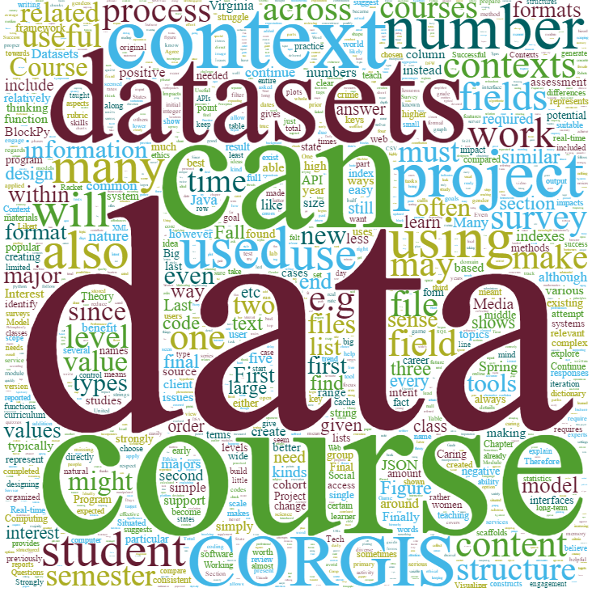

My name is Austin Cory Bart, and I'm an Assistant Professor at the University of Delaware. In spring 2017, I received my PhD in Computer Science with a Learning Sciences certification from Virginia Tech.

My [CV](/papers/cv-latex.pdf) as of 9/14/2018.

Check out some of my work:

* [CORGIS project](http://think.cs.vt.edu/corgis)
* [BlockPy](http://think.cs.vt.edu/blockpy)
* [Computational Thinking course (CT@VT)](http://think.cs.vt.edu/ct/)
* [AnimalScienceCraft](#)

I study introductory computing experiences, both in terms of student motivation and cognition. When I teach, I try to keep the following in mind:
* Have I provided a structure learning experience with clear expectations and instructions?
* Have I provided opportunities for participation with feedback?
* Am I supporting students internal agency, sense of usefulness, self-efficacy, personal interests, and perception of my caring?
* Have I provided sufficient learning resources, including lectures, readings, videos, visualizations, and examples?
* Have I outlined ways for them to go beyond what is present in the lesson?
* Do I have a systematic way to review, revise, and replicate the learning materials I have created?

My primary research interest is Digital Education, which can be broadly divided into two facets:

**Computer Science Education** - The study and practice of teaching people how to become better Computer Scientists. This includes:

* Measurably improving student performance with regards to concrete learning objectives
* Generating and improving immediate feedback to support learners
* Creation of tools to directly improve CS classrooms
* Better understanding the role of contextualization in how students learn
* Increasing diversity and student perspectives, especially with regards to women in computing
* Increasing student motivation to learn and use CS concepts/tools

**Learning Sciences** - The study and application of how people learn. This includes:

* Investigating how people learn and the best ways to teach (especially Instructional Design)
* Novel learning software to teach myriad subjects and skills, especially 21st century skills like Computational Thinking
* Pedagogy of educational software development
* Development of abstract frameworks for learning software

Digital Education is not just about pedagogy or technology. This subject lies at the intersection of many disciplines: software engineering, learning sciences, data science, information storage and retrieval, cognitive science, and more. These disciplines are required by Digital Education researchers to develop tools, artifacts, and techniques to aid the educational process.

My goal is to create technical scaffolding that can support educational experiences for students and aid instructors. I have created, and will create in the future, technological tools that are useful at levels from kindergarten to undergraduates. I am extremely comfortable wearing the hat of a software developer and a curriculum developer. Through these experiences, I have come to recognize and appreciate the human element in teaching and learning, and how software can be used to support that process.

